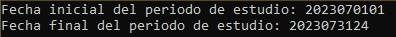

Uso del programa
============================

Inicio de la simulación
____________________________

Si los archivos de entrada han sido incorporados correctamente, entonces el modelo puede ser usado para simular periodos específicos.

Para esto, el programa requerirá ingresar el periodo de estudio de la siguiente manera:

- Periodo de inicio del estudio en formato: AAAAMMDD
- Periodo de término del estudio en formato: AAAAMMDD

|

Una vez ingresados estos valores, el programa comenzará la carga de archivos y la revisión de documentos para iniciar la simulación.

Cabe destacar que los documentos deben ser ingresados con el formato correcto, o de lo contrario los periodos de estudio no serán correctamente calculados.

Término de la simulación
____________________________
Al terminar la simulación, existirán dos archivos principales de salida:

.. drawio-image:: ./drawios/Mapas.drawio
   :align: center
   :format: png
   :page-index: 1
   :export-scale: 150

|

- **Costos Marginales.xlsx**
   - Este archivo contiene los valores horarios del costo marginal original y nuevo costo marginal calculado en la simulación.

   .. image:: images/CMgS.jpg
      :align: center
      :alt: Alternative text

- **Generación de la central.xlsx**
   - Este archivo contiene la generación simulada de la central de estudio por bloque horario, bajo las reglas descritas por el algoritmo de simulación.

   .. image:: images/Gen.jpg
      :align: center
      :alt: Alternative text